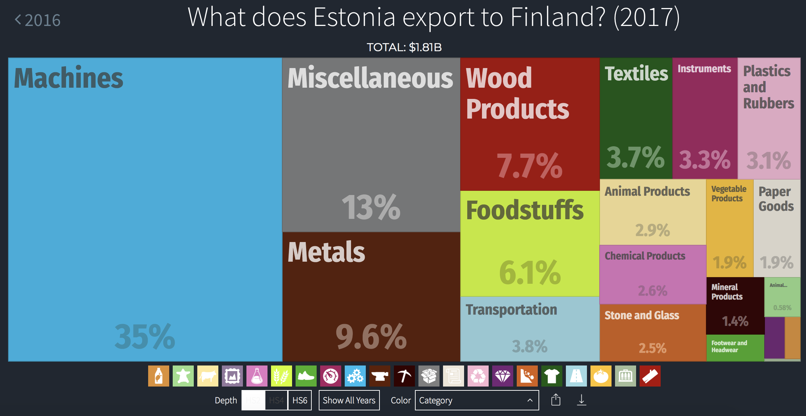

# Estonia Data Validation
Any questions regarding differences in data will be addressed here. In order to compare faster, we will only use the values of products exported to Finland during 2017.

### 1. Data from Estonia API
The data files will be downloaded directly from the Statistics Estonia API. 


```python
from IPython.display import Image
import pandas as pd
import requests
import json
import os

url = "http://andmebaas.stat.ee/sdmx-json/data/VK10_2/TRD_VAL.EXP..FI.A/all?startTime=2017&endTime=2017&dimensionAtObservation=allDimensions"

if "finland_exports.json" not in os.listdir():
    cube = requests.get(url)
    with open("finland_exports.json", "w") as file:
        file.write(cube.text)
        
else:
    with open("finland_exports.json") as file:
        cube = json.loads(file.read())

# Dictionary of Products

prod = {}
a = 0
for p in cube["structure"]["dimensions"]["observation"][2]["values"]:
    prod[str(a)] = p["id"]
    a += 1

# Dataframe Creation

products = []
totals = []
for key in cube["dataSets"][0]["observations"]:
    products.append(key.split(":")[2])
    totals.append(int(cube["dataSets"][0]["observations"][key][0]))
    
df = pd.DataFrame({"product": products, "total": totals})

# Mapping

df["product"] = df["product"].map(prod)

# Querying

print("TOTAL: " + "$" + "{:,}".format(df[df["product"] == "TOTAL"]["total"].sum()) + " EUR")
print("HS2 Sum: " + "$" + "{:,}".format(df[(~ df["product"].str.isalpha()) & (df["product"].str.len() == 4)]["total"].sum()) + " EUR")
print("HS4 Sum: " + "$" + "{:,}".format(df[(~ df["product"].str.isalpha()) & (df["product"].str.len() == 6)]["total"].sum()) + " EUR")
print("HS6 Sum: " + "$" + "{:,}".format(df[(~ df["product"].str.isalpha()) & (df["product"].str.len() == 8)]["total"].sum()) + " EUR")
print("HS8 Sum: " + "$" + "{:,}".format(df[(~ df["product"].str.isalpha()) & (df["product"].str.len() == 10)]["total"].sum()) + " EUR")
```

    TOTAL: $2,075,813,064 EUR
    HS2 Sum: $2,075,813,061 EUR
    HS4 Sum: $1,852,187,796 EUR
    HS6 Sum: $1,852,187,806 EUR
    HS8 Sum: $1,852,187,835 EUR


The Statistics Estonia site shows $2,075,813,064 EUR as the total value, so the values on the API and SE site match.

### 2. Data from Database in Estonia Production Server
The data files will be downloaded from the Tesseract API in https://data.stat.ee. The querys will have drilldowns by each product level and by country.


```python
import pandas as pd
import requests
import json
import os

urls = {"HS2": "https://data.stat.ee/tesseract/data?cube=exports_and_imports&Year=2017&Flow=1&Country=fi&drilldowns=HS2&measures=Total",
        "HS4": "https://data.stat.ee/tesseract/data?cube=exports_and_imports&Year=2017&Flow=1&Country=fi&drilldowns=HS4&measures=Total",
        "HS6": "https://data.stat.ee/tesseract/data?cube=exports_and_imports&Year=2017&Flow=1&Country=fi&drilldowns=HS6&measures=Total",
        "Country": "https://data.stat.ee/tesseract/data?cube=exports_and_imports&Year=2017&Flow=1&drilldowns=Country&measures=Total"}

for level in ["HS2", "HS4", "HS6", "Country"]:
    query = requests.get(urls[level])
    query = json.loads(query.text)
    
    if level == "Country":
        vec = []
        for key in query["data"]:
            if key["Country ID"] == "fi":
                vec.append(int(key["Total"]))
    
    else:
        vec = []
        for key in query["data"]:
            vec.append(int(key["Total"]))
    
    print(level + " Sum: " + "$" + "{:,}".format(sum(vec)) + " EUR")
```

    HS2 Sum: $1,849,379,662 EUR
    HS4 Sum: $1,849,379,662 EUR
    HS6 Sum: $1,849,379,662 EUR
    Country Sum: $1,849,379,662 EUR


We can see that the values match between them, but don't match with the values from the Estonia API. (This step will be checked in the Bamboo script).

### 3. Data from the Front End in the TradeEstonia Site

The total in the TradeEstonia Site shows "3,55B" or approximately $3,550,000,000 EUR


### 4. Data from OEC

The total in the OEC Site shows "1,81B" or approximately $1,810,000,000 EUR


